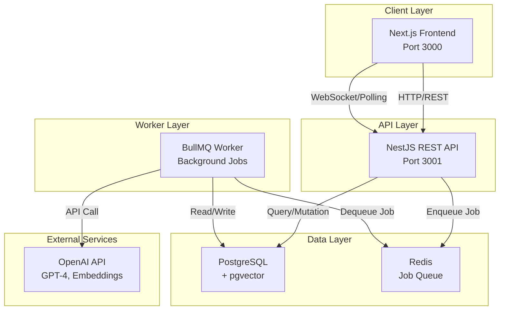
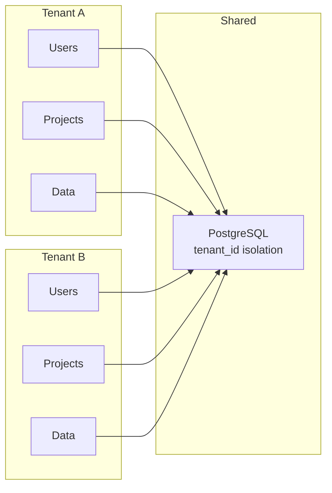
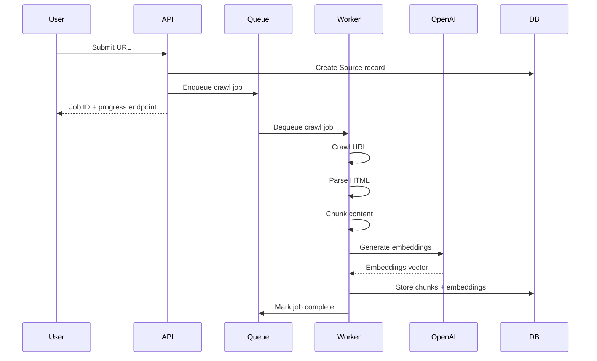
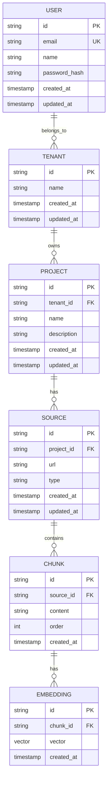

# STRATIX AI - System Architecture

## High-Level Architecture



## Multi-Tenant Architecture



## Data Flow: URL Ingestion & Embedding



## Database Schema (Phase 0 Foundation)



## Deployment Architecture

### Backend (Railway)

```
Railway Project
├── PostgreSQL Database
├── Redis Instance
└── NestJS API + Worker
    ├── /api/* routes
    └── Background job processor
```

### Frontend (Hostinger)

```
Hostinger Hosting
├── Next.js Static/SSR Build
├── CDN Distribution
└── Environment: NEXT_PUBLIC_API_URL=https://api.railway.app
```

## Security & Isolation

1. **Multi-Tenant Isolation**: All queries filtered by `tenant_id`
2. **JWT Authentication**: Stateless token-based auth
3. **CORS**: Frontend origin whitelist
4. **Rate Limiting**: Per-user request throttling
5. **Audit Logging**: All mutations logged with user/tenant context
6. **Data Encryption**: Passwords hashed with bcrypt

## Performance Considerations

- **Database Indexing**: Indexes on `tenant_id`, `user_id`, `project_id`
- **Pagination**: All list endpoints paginated (default 20 items)
- **Caching**: Redis for job queue and future session caching
- **Async Processing**: Heavy workloads via BullMQ
- **Vector Search**: pgvector for semantic similarity queries

## Development vs Production

| Aspect | Development | Production |
|--------|-------------|-----------|
| Database | Local PostgreSQL | Railway PostgreSQL |
| Redis | Local Redis | Railway Redis |
| API URL | http://localhost:3001 | https://api.railway.app |
| Frontend URL | http://localhost:3000 | https://stratix.ai |
| Logging | Console | Structured JSON logs |
| Error Handling | Verbose | User-friendly messages |
