# STRATIX AI - Architecture Diagrams

Comprehensive system architecture visualizations for STRATIX AI.

## System Architecture

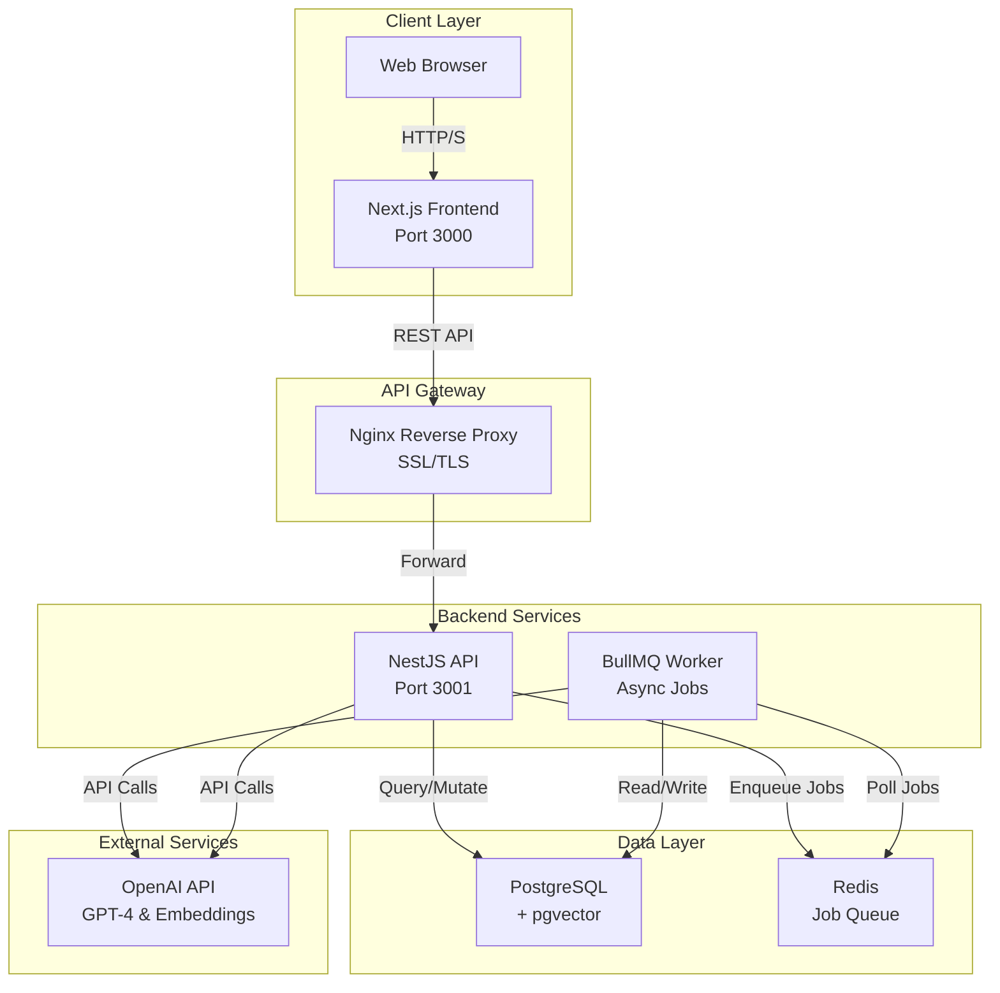

## Data Flow - Project Ingestion

```mermaid
graph LR
    USER["User"]
    
    subgraph "Frontend"
        UI["Upload UI<br/>URL Input"]
    end
    
    subgraph "Backend API"
        CTRL["Sources Controller"]
        SVC["Sources Service"]
    end
    
    subgraph "Job Queue"
        QUEUE["BullMQ Queue"]
    end
    
    subgraph "Worker"
        CRAWLER["Crawler Service"]
        PARSER["Parser Service"]
        CHUNK["Chunking Service"]
        EMBED["Embeddings Service"]
    end
    
    subgraph "Database"
        DB["PostgreSQL"]
    end
    
    USER -->|Upload URL/File| UI
    UI -->|POST /sources| CTRL
    CTRL -->|Validate & Store| SVC
    SVC -->|Enqueue Job| QUEUE
    QUEUE -->|Dequeue| CRAWLER
    CRAWLER -->|Extract Text| PARSER
    PARSER -->|Segment Text| CHUNK
    CHUNK -->|Generate Vectors| EMBED
    EMBED -->|Store Records| DB
```

## Data Flow - Strategy Generation

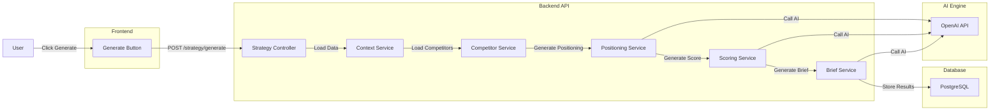

## Async Job Processing

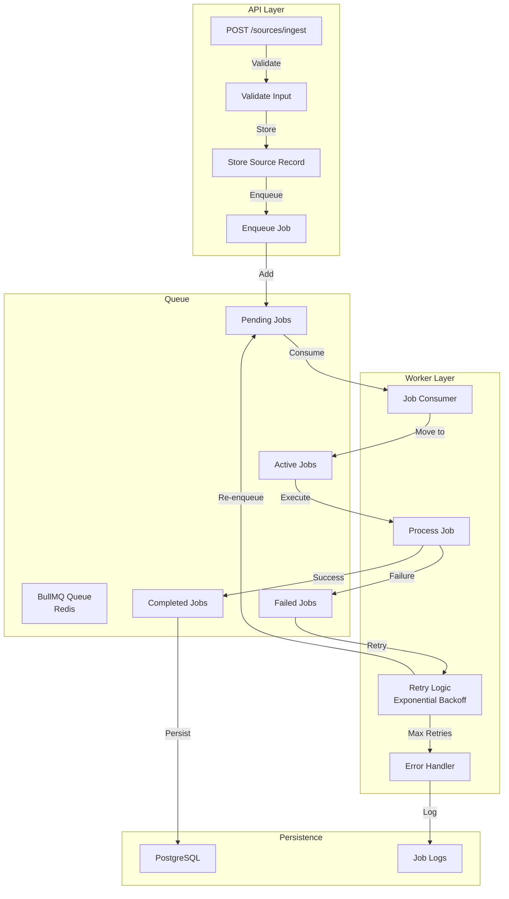

## Entity Relationship Diagram

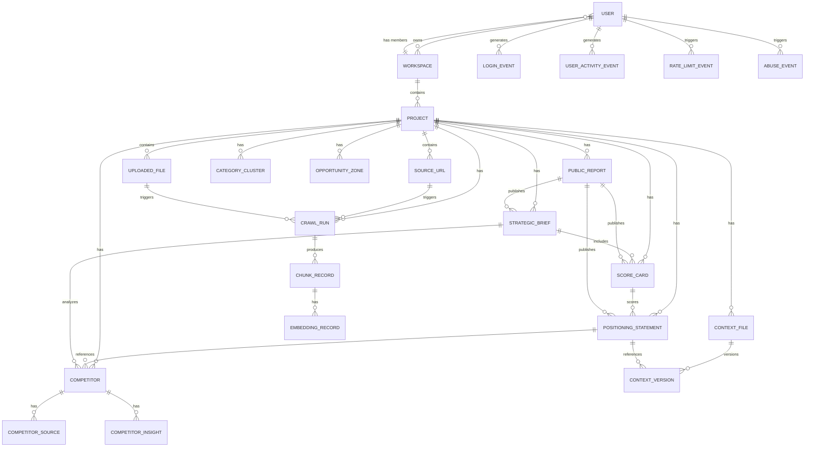

## Authentication Flow

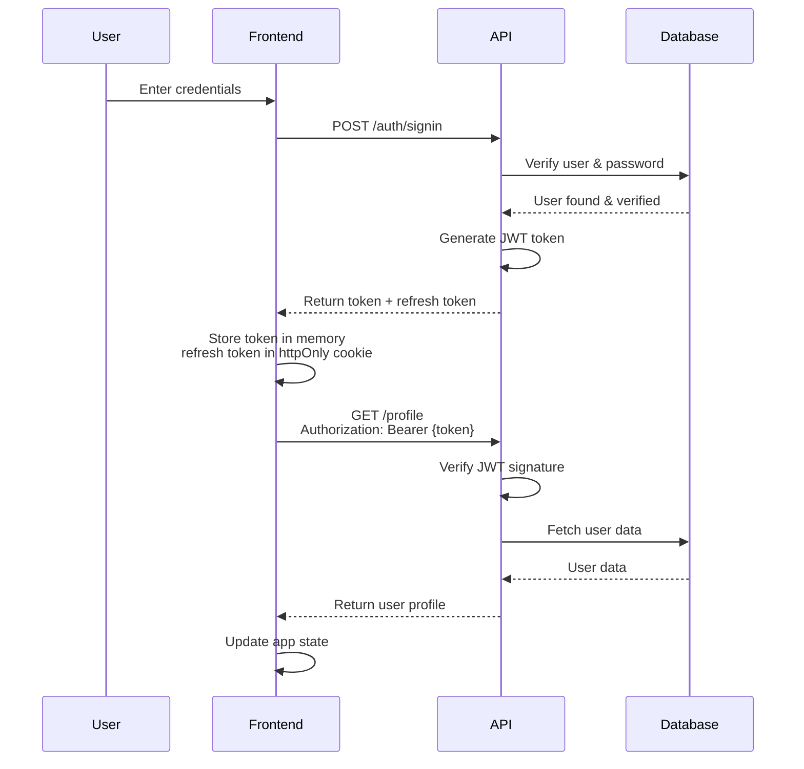

## Multi-Tenant Isolation

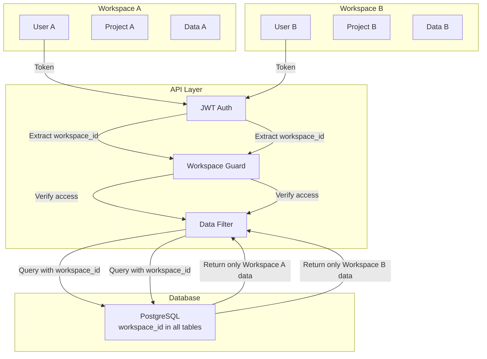

## Rate Limiting & Abuse Control

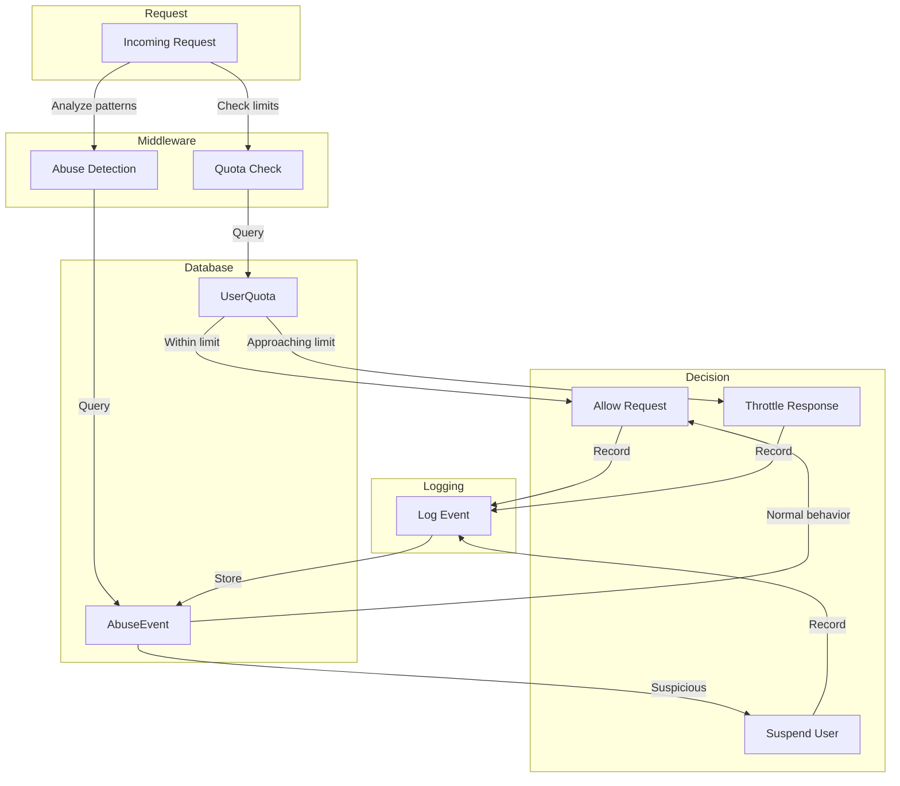

## Context Engine Pipeline

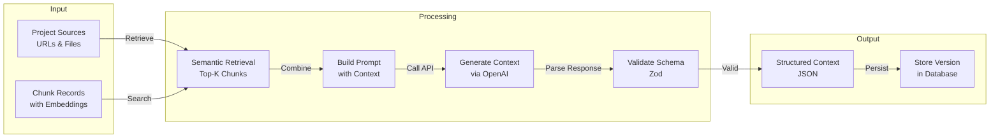

## Competitor Discovery Pipeline

```mermaid
graph LR
    subgraph "Input"
        CONTEXT["Business Context<br/>Market Category<br/>ICP"]
    end
    
    subgraph "Discovery"
        ANALYZE["Analyze Context<br/>Extract Keywords"]
        GENERATE["Generate Competitors<br/>via OpenAI"]
        VALIDATE["Validate Names<br/>& Websites"]
    end
    
    subgraph "Processing"
        CRAWL["Crawl Competitor<br/>Websites"]
        CHUNK["Chunk Content"]
        EMBED["Generate Embeddings"]
    end
    
    subgraph "Analysis"
        ANALYZE_COMP["Analyze Positioning<br/>vs Your Context"]
        EXTRACT["Extract Insights<br/>Strengths/Weaknesses"]
        STORE["Store Intelligence<br/>in Database"]
    end
    
    CONTEXT -->|Extract| ANALYZE
    ANALYZE -->|Call AI| GENERATE
    GENERATE -->|Validate| VALIDATE
    VALIDATE -->|Crawl| CRAWL
    CRAWL -->|Process| CHUNK
    CHUNK -->|Vectorize| EMBED
    EMBED -->|Compare| ANALYZE_COMP
    ANALYZE_COMP -->|Extract| EXTRACT
    EXTRACT -->|Persist| STORE
```

## Deployment Architecture

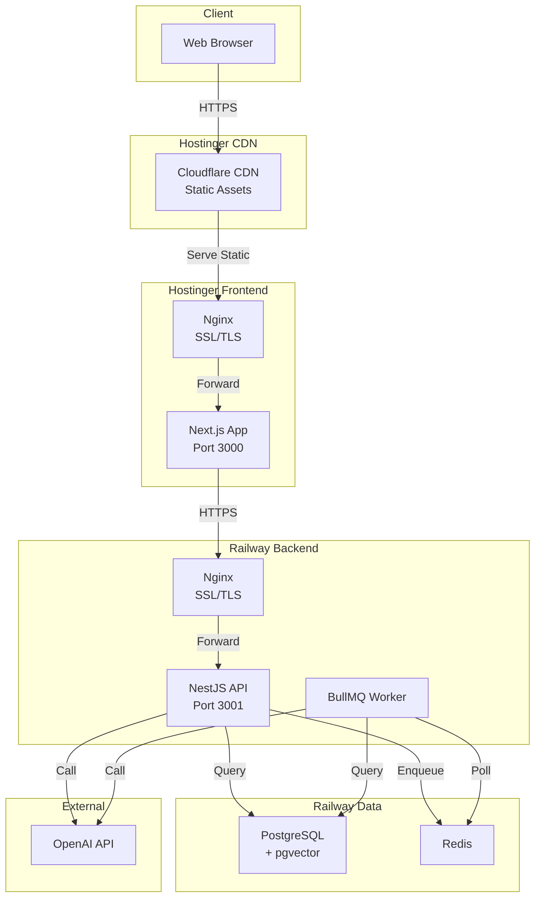

## Error Handling & Resilience

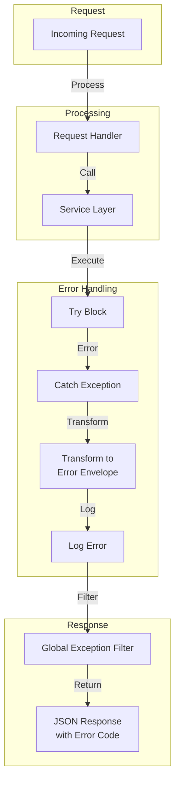

## Performance Optimization

```mermaid
graph TB
    subgraph "Frontend"
        CACHE["Browser Cache<br/>Service Worker"]
        LAZY["Lazy Loading<br/>Code Splitting"]
        COMPRESS["Gzip Compression"]
    end
    
    subgraph "Backend"
        QUERY["Query Optimization<br/>Indexes"]
        BATCH["Batch Processing<br/>BullMQ"]
        REDIS_CACHE["Redis Cache<br/>Hot Data"]
    end
    
    subgraph "Database"
        INDEX["PostgreSQL Indexes<br/>on workspace_id"]
        PARTITION["Partition Large Tables"]
        VACUUM["Periodic VACUUM"]
    end
    
    subgraph "Monitoring"
        METRICS["Prometheus Metrics"]
        LOGS["Structured Logs"]
        ALERTS["Alert Rules"]
    end
    
    CACHE -->|Reduce Requests| LAZY
    LAZY -->|Faster Load| COMPRESS
    QUERY -->|Reduce Latency| BATCH
    BATCH -->|Improve Throughput| REDIS_CACHE
    INDEX -->|Faster Queries| PARTITION
    PARTITION -->|Better Performance| VACUUM
    METRICS -->|Track Performance| LOGS
    LOGS -->|Trigger| ALERTS
```

These diagrams provide a comprehensive view of STRATIX AI's architecture, data flows, and deployment strategy.
